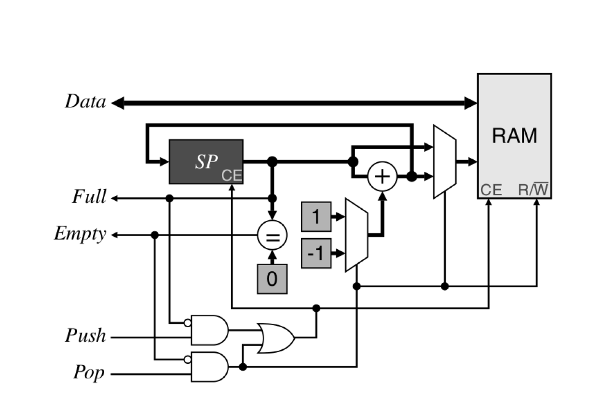

# Stack

A stack is a memory structure that allows the data items to be visited twice, although, contrary to a FIFO buffer, the second
time the items are accessed in the reverse order. Items are pushed onto a stack by storing them in successive memory locations.
When an item is popped from the stack, the most recently saved item is retrieved first

The following figures shows the block diagram of the stack.

In the figure, a multiplexer is used to add either 1 or -1 to SP depending on whether
a push or a pop is performed, respectively. A push uses SP directly as the RAM address, whereas a pop uses the decremented
SP as the address. The stack is empty if the address is zero. The stack is full after the last memory element is written.
Incrementing SP will wrap it past the end. This is prevented by making SP one bit longer than needed to address the memory.
The stack is then full when the most significant bit of SP is set.
